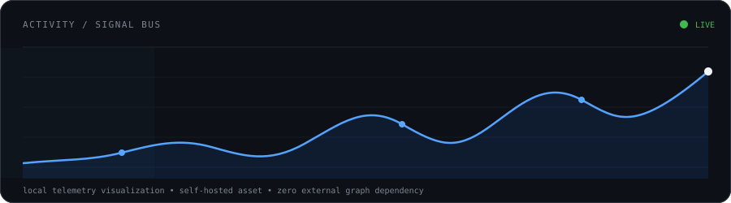
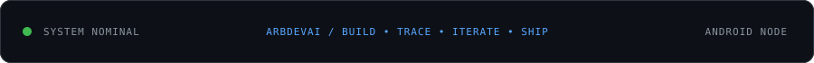

<div align="center">



<br/>


<br/><br/>

<code>ANDROID NATIVE</code>&nbsp;&nbsp;<code>AI SYSTEMS</code>&nbsp;&nbsp;<code>WEB PRODUCTS</code>&nbsp;&nbsp;<code>AUTOMATION</code>

</div>

<br/>

<table>
<tr>
<td width="50%" valign="top">

### SYSTEM / PROFILE

```yaml
handle: arbdevai
role: builder / tinkerer
workspace: Android + Termux + Linux
runtime: Java / JavaScript
backend: Firebase
frontend: React + Vite
mode: prototype -> inspect -> iterate -> ship
```

</td>
<td width="50%" valign="top">

### NOW / BUILDING

```text
[01] native Android tooling
[02] AI agents + integrations
[03] Firebase-backed products
[04] React / Vite interfaces
[05] developer automation
[06] network utilities
```

</td>
</tr>
</table>

<br/>

<div align="center">



</div>

<br/>

### ACTIVITY / SIGNAL

<div align="center">



</div>

<br/>

### LAB / PRINCIPLE

> **Build useful things with whatever hardware is available.**  
> The workstation is optional. The ability to inspect a problem is not.

```text
INPUT       rough idea / actual problem
PROCESS     prototype -> break -> trace -> rebuild
OUTPUT      software that survives outside the demo
```

<br/>

<div align="center">



</div>
